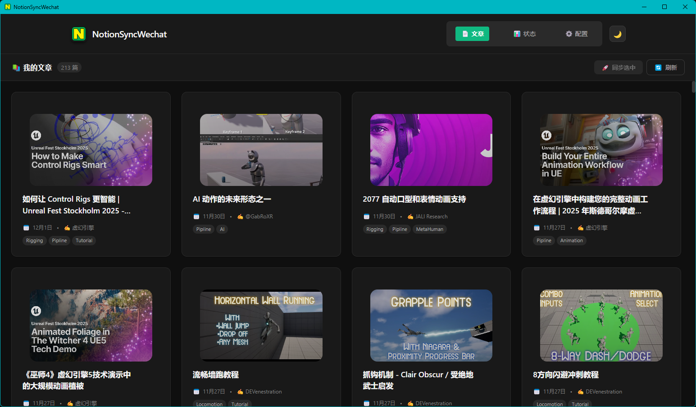

# NotionSyncOne

<div align="center">
  
  <h3>将 Notion 文章一键同步到多平台</h3>
  <p>微信公众号 · WordPress · Bilibili</p>
  
  
  
  
</div>



## ✨ 功能亮点

- 🔄 **一键同步** - Notion 文章智能转换为多平台格式
- 📸 **图片自动上传** - 无需手动处理，图片自动上传到目标平台
- 🎬 **B站视频投稿** - 自动提取视频并投稿到B站（支持草稿/发布）
- 💎 **精美排版** - 代码高亮、链接优化、自适应布局
- 📊 **实时状态** - 同步进度和状态一目了然
- ⚙️ **简单配置** - 一次配置，持久保存

### 🎯 支持平台

| 平台 | 功能 | 状态 |
|------|------|------|
| **微信公众号** | 图文同步、草稿/发布 | ✅ |
| **WordPress** | 文章发布、分类标签 | ✅ |
| **Bilibili** | 视频投稿、自动压缩 | ✅ |

## 🚀 快速开始

### 📥 下载安装（推荐）

1. 前往 [Releases](https://github.com/AniBullet/NotionSyncOne/releases) 下载最新版
2. 运行安装程序或便携版
3. 配置 Notion API 和平台信息
4. 开始同步！

### 💻 源码运行

```bash
# 1. 克隆项目
git clone https://github.com/AniBullet/NotionSyncOne.git
cd NotionSyncOne

# 2. 一键初始化（Windows）
.\scripts\setup.ps1

# 3. 启动应用
pnpm dev
```

<details>
<summary>📋 前置要求</summary>

**必须：**
- Node.js 18+
- Notion API Key

**可选（按需）：**
- 微信公众号 AppID/AppSecret
- WordPress 应用密码
- biliup-rs + FFmpeg（B站投稿）

</details>

## ⚙️ 配置指南

<details>
<summary><b>1️⃣ Notion 配置（必须）</b></summary>

1. 访问 [Notion Integrations](https://www.notion.so/my-integrations) 创建 Integration
2. 复制 API Key
3. 打开数据库，从 URL 中获取 Database ID：
   
   **URL 格式：** `https://www.notion.so/xxx/[DatabaseID]?v=zzz`
   
   例如：`https://www.notion.so/workspace/abc123def456?v=789`  
   其中 `abc123def456` 就是 Database ID

4. 在应用中填入 API Key 和 Database ID

</details>

<details>
<summary><b>2️⃣ 微信公众号配置（可选）</b></summary>

1. 登录 [微信公众平台](https://mp.weixin.qq.com/)
2. 进入"设置与开发 > 基本配置"获取 AppID 和 AppSecret
3. 将服务器 IP 添加到白名单

</details>

<details>
<summary><b>3️⃣ WordPress 配置（可选）</b></summary>

1. 确保 WordPress 版本 >= 5.6
2. 在"用户 → 个人资料 → 应用密码"生成密码
3. 填入站点 URL、用户名和应用密码

</details>

<details>
<summary><b>4️⃣ Bilibili 配置（可选）</b></summary>

```bash
# Windows 安装 biliup-rs 和 FFmpeg
winget install biliup
winget install BtbN.FFmpeg.GPL
```

详细说明：[B站投稿指南](./docs/BILIBILI_GUIDE.md)

</details>

## 🎯 使用流程

```
Notion 编写 → 点击同步 → 选择平台 → 完成发布
```

1. **准备文章** - 在 Notion 中编写（支持文字、图片、代码、视频）
2. **刷新列表** - 应用中点击"刷新"获取最新文章
3. **选择平台** - 点击对应平台的同步按钮
4. **查看结果** - 在对应平台后台查看发布结果

## 📦 开发打包

```bash
# 快速命令（Windows）
scripts\build.cmd          # 生产构建
scripts\dev.cmd            # 开发模式
scripts\check_security.cmd # 安全检查

# 或手动执行
pnpm build                 # 构建应用
pnpm dev                   # 开发模式
```

打包产物在 `dist/` 目录，推荐分享便携版（体积小，无需安装）。

<details>
<summary>🛠️ 技术栈</summary>

- **Electron** - 桌面应用框架
- **React** + **TypeScript** - 前端开发
- **Vite** - 构建工具
- **Tailwind CSS** - 样式框架
- **Notion API** / **微信 API** / **WordPress REST API**

</details>

## ❓ 常见问题

<details>
<summary><b>图片上传失败？</b></summary>

应用会自动使用代理绕过防盗链，检查图片 URL 是否可访问。

</details>

<details>
<summary><b>同步失败？</b></summary>

1. 检查 Notion API Key 和 Database ID 是否正确
2. 确保 Integration 已添加到数据库权限
3. 检查平台配置（AppID、密码等）是否正确

</details>

<details>
<summary><b>B站投稿失败？</b></summary>

1. 确保已安装 `biliup-rs` 和 `FFmpeg`
2. 检查 Cookie 是否过期（重新登录）
3. 视频格式是否支持（建议 MP4）

</details>

更多问题查看 → [完整文档](./docs/QUICK_START.md)

## 📚 文档

- 📖 [快速开始指南](./docs/QUICK_START.md)
- 🎬 [B站投稿指南](./docs/BILIBILI_GUIDE.md)
- 🚀 [部署指南](./docs/DEPLOY.md)
- 📋 [更新日志](./docs/CHANGELOG.md)
- 🤝 [贡献指南](./docs/CONTRIBUTING.md)
- 🔒 [安全说明](./docs/SECURITY.md)

## 🙏 致谢

本项目参考了以下优秀开源项目：

- [Wheeeeeeeeels/zaka-notion2pubflow](https://github.com/Wheeeeeeeeels/zaka-notion2pubflow) - 项目灵感来源
- [nmvr2600/notion2wechat](https://github.com/nmvr2600/notion2wechat) - 排版优化参考
- [biliup/biliup](https://github.com/biliup/biliup) - B站上传工具

## 📄 许可证

本项目采用 [MIT](LICENSE) 许可证

## 👤 作者

[Bullet.S](https://space.bilibili.com/2031113) - Bilibili 主页

---

<div align="center">

**如果这个项目对你有帮助，请给个 ⭐️ Star！**

[报告问题](https://github.com/AniBullet/NotionSyncOne/issues) · [功能建议](https://github.com/AniBullet/NotionSyncOne/issues) · [提交PR](https://github.com/AniBullet/NotionSyncOne/pulls)

</div>
