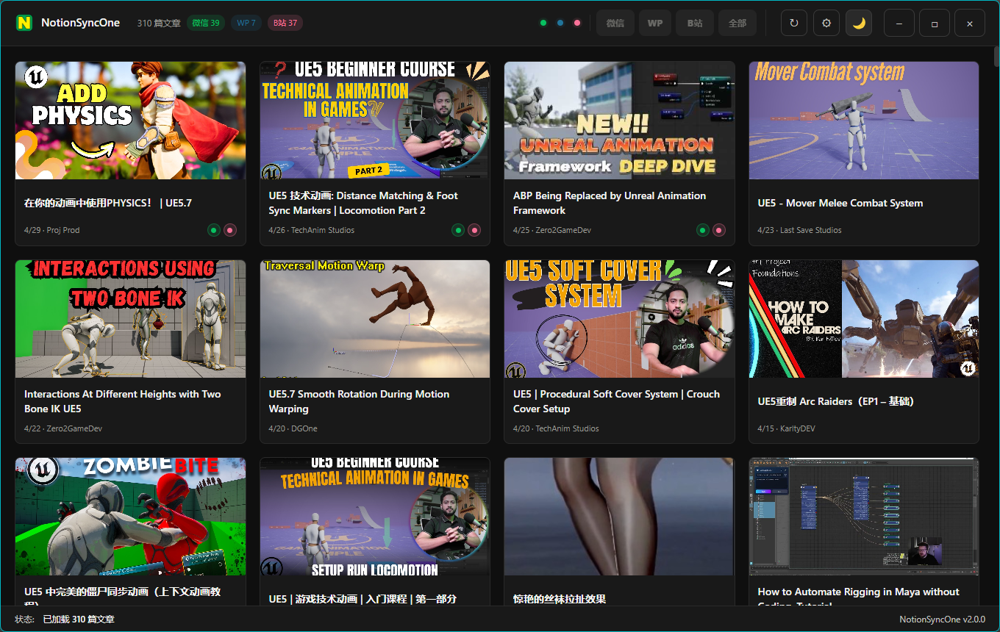

# NotionSyncOne

<div align="center">
  
  <h3>将 Notion 文章一键同步到多平台</h3>
  <p>微信公众号 · WordPress · Bilibili</p>

  
  
  
</div>



## 功能亮点

- **一键同步** — Notion 文章智能转换为多平台格式
- **图片自动上传** — 图片自动上传到目标平台，无需手动处理
- **B站视频投稿** — 自动提取视频并投稿，支持指定合集分区
- **精美排版** — 代码高亮、链接优化、自适应布局
- **实时状态** — 同步进度和失败记录一目了然
- **灵活配置** — 字段映射可自定义、同步渠道可按需开关

### 支持平台

| 平台 | 功能 | 状态 |
|------|------|------|
| **微信公众号** | 图文同步、草稿/发布、多主题排版 |  |
| **Bilibili** | 视频投稿、合集管理、分区搜索 |  |
| **WordPress** | 文章发布、分类标签 |  |

## 快速开始

### 下载安装（推荐）

1. 前往 [Releases](https://github.com/AniBullet/NotionSyncOne/releases) 下载最新版
2. 运行安装程序或便携版
3. 配置 Notion API 和平台信息
4. 开始同步

### 源码运行

```bash
# 1. 克隆项目
git clone https://github.com/AniBullet/NotionSyncOne.git
cd NotionSyncOne

# 2. 初始化环境
node run-setup.js
# 或在 Cursor 中打开 run-setup.js，点击 Run Code

# 3. 启动开发服务器
node run-dev.js
# 或按 Ctrl+Shift+B
# 或运行 pnpm dev
```

<details>
<summary>前置要求</summary>

**必须：**
- Node.js 18+
- Notion API Key

**可选（按需启用）：**
- 微信公众号 AppID / AppSecret
- WordPress 应用密码
- biliup + FFmpeg（B站投稿）

</details>

## 配置指南

<details>
<summary><b>Notion 配置（必须）</b></summary>

#### 创建 Integration

1. 访问 [Notion Integrations](https://www.notion.so/my-integrations) 创建 Integration
2. 复制 API Key
3. 从数据库 URL 中获取 Database ID：

   **URL 格式：** `https://www.notion.so/xxx/[DatabaseID]?v=zzz`

   例如：`https://www.notion.so/workspace/abc123def456?v=789`
   其中 `abc123def456` 就是 Database ID

4. 在数据库页面点击右上角「···」→「添加连接」→ 选择你创建的 Integration

#### 数据库字段

数据库**至少**需要以下字段：

| 字段名 | 类型 | 说明 |
|--------|------|------|
| **Title** | 标题 | 文章标题（Notion 默认字段） |
| **AddedTime** | 日期 | 添加时间，用于排序 |

其余字段均可选，并支持在应用设置中自定义字段名映射：

| 默认字段名 | 类型 | 说明 |
|-----------|------|------|
| LinkStart | URL 或文本 | 原文链接 |
| From | 文本 | 来源平台 |
| Author | 文本 | 原作者 |
| FeatureTag | 单选或多选 | 标签 |
| ExpectationsRate | 数字 | 个人期待值 |
| Engine | 单选 | 分类 |

> 字段名不匹配时，在应用「设置 → Notion」中修改映射，无需改数据库结构。

#### 配置应用

在「设置 → Notion」填入：
- **API Key**：Integration 密钥
- **Database ID**：数据库 ID

</details>

<details>
<summary><b>微信公众号配置（可选）</b></summary>

#### 获取 AppID 和 AppSecret

1. 登录 [微信公众平台](https://mp.weixin.qq.com/)
2. 进入「设置与开发」→「基本配置」
3. 复制 **AppID** 和 **AppSecret**（需管理员扫码确认）

#### IP 白名单

同步时如提示 IP 未加白名单：

1. 在「基本配置」页面找到「IP 白名单」，点击「修改」
2. 添加你的本机 IP（可访问 [ipinfo.io/ip](https://ipinfo.io/ip) 查看）

#### 主题样式（可选）

在微信配置中填入 `theme` 字段：

| 值 | 效果 |
|----|------|
| `default` | 蓝色主题 |
| `wechat` | 微信绿（推荐） |
| `hongfei` | 红色 |
| `jianhei` | 黑色极简 |
| `shanchui` | 橙黄温暖 |
| `chengxin` | 橙色活力 |

#### 标题模板（可选）

使用 `{title}` 变量代表原标题，例如：

- `【转载】{title}` — 添加前缀
- `{title}【原创】` — 添加后缀

</details>

<details>
<summary><b>WordPress 配置（可选）</b></summary>

#### 前置要求

- WordPress >= 5.6
- REST API 已启用（默认启用）

#### 生成应用密码

1. 登录 WordPress 后台 → 「用户」→「个人资料」
2. 滚动到底部「应用密码」，填写名称后点击「添加新应用密码」
3. 复制生成的密码（格式：`xxxx xxxx xxxx xxxx`）

> 应用密码可随时撤销，不影响登录密码。

#### 配置应用

在「设置 → WordPress」启用后填入：
- **站点 URL** — 如 `https://example.com`
- **用户名** — WordPress 管理员用户名
- **应用密码** — 刚刚生成的密码（保留或删除空格均可）

#### 可选配置

支持默认分类、标签和标题模板，格式同微信（使用 `{title}` 变量）。

</details>

<details>
<summary><b>Bilibili 配置（可选）</b></summary>

#### 安装依赖工具

```bash
# 安装 biliup（B站上传工具）
uv tool install biliup

# 安装 FFmpeg（视频处理）
winget install BtbN.FFmpeg.GPL
```

**手动安装：**
- biliup：[github.com/biliup/biliup](https://github.com/biliup/biliup/releases)（旧仓库 biliup-rs 已归档，请用此链接）
- FFmpeg：[ffmpeg.org/download.html](https://ffmpeg.org/download.html)

安装后验证：

```bash
biliup --version
ffmpeg -version
```

#### 登录 B站账号

```bash
biliup login   # 扫码登录（推荐）
```

#### 功能说明

- 自动提取 Notion 页面中的视频并投稿
- 视频过大时自动用 FFmpeg 压缩
- 支持草稿和直接发布两种模式
- 支持在设置页选择默认投稿分区（可搜索）
- 支持在设置页选择默认合集，上传后自动加入

#### 简介模板变量

在设置页可配置简介模板，支持以下变量：

| 变量 | 说明 |
|------|------|
| `{title}` | 文章标题 |
| `{author}` | 原作者 |
| `{source}` | 来源平台 |
| `{link}` | 原文链接 |
| `{date}` | 发布日期 |

</details>

## 使用流程

```
Notion 编写 → 点击同步 → 选择平台 → 完成发布
```

1. **准备文章** — 在 Notion 中编写，支持文字、图片、代码、视频
2. **刷新列表** — 应用中点击"刷新"获取最新文章
3. **选择平台** — 点击对应平台的同步按钮
4. **查看结果** — 在对应平台后台查看发布结果

## 开发打包

```bash
# 开发模式
node run-dev.js          # 推荐：支持 Run Code
pnpm dev:start           # npm scripts
# 或按 Ctrl+Shift+B

# 生产构建
node run-build.js        # 推荐：支持 Run Code
pnpm build:start         # npm scripts

# 检查
pnpm check:type          # 类型检查
pnpm check:lint          # 代码规范
pnpm check:test          # 测试
pnpm check               # 全部
```

打包产物在 `dist/` 目录，推荐分发 `portable` 版本（体积小，无需安装）。

<details>
<summary>技术栈</summary>

- **Electron** — 桌面应用框架
- **React** + **TypeScript** — 前端开发
- **Vite** — 构建工具
- **Tailwind CSS** — 样式框架
- **Notion API** / **微信 API** / **WordPress REST API** / **Bilibili API**

</details>

## 常见问题

<details>
<summary><b>安装时弹出「Windows 已保护你的电脑」警告？</b></summary>

这是正常现象，应用本身完全安全。

本应用未购买 Windows 代码签名证书，Windows Defender SmartScreen 会对所有来自互联网的未签名 exe 显示此提示。

在弹出的绿色警告框中点击「更多信息」，再点击「仍要运行」即可正常安装。同一台电脑只需操作一次，每次新版本首次运行时会再次出现，处理方式相同。

</details>

<details>
<summary><b>提示「找不到指定的数据库」？</b></summary>

Integration 没有访问数据库的权限。

打开 Notion 数据库页面 → 右上角「···」→「添加连接」→ 选择你创建的 Integration，然后重新刷新列表。

</details>

<details>
<summary><b>Notion 同步失败，提示网络错误？</b></summary>

1. 检查网络连接，必要时使用代理
2. 确认 API Key 和 Database ID 无误
3. 应用会自动重试 3 次，网络不稳定时稍等即可

</details>

<details>
<summary><b>微信图片上传失败？</b></summary>

常见原因：

- 服务器 IP 未加入白名单 → 在微信公众平台添加本机 IP
- 图片过大 → 确保单张图片 < 5MB

</details>

<details>
<summary><b>WordPress 发布失败？</b></summary>

1. 重新生成应用密码并更新配置
2. 确认 WordPress >= 5.6
3. 检查是否有插件禁用了 REST API

</details>

<details>
<summary><b>B站投稿失败？</b></summary>

1. 确认工具已安装：`biliup --version` 和 `ffmpeg -version`
2. Cookie 过期时重新登录：`biliup login`
3. 视频建议使用 MP4 格式，大小符合 B站账号等级对应限制

</details>

<details>
<summary><b>Notion 字段名和我数据库里的不一样？</b></summary>

在「设置 → Notion → 字段映射」中修改对应字段名即可，无需改数据库结构。

</details>

<details>
<summary><b>配置文件存储在哪里？</b></summary>

**Windows**：`C:\Users\你的用户名\AppData\Roaming\notionsyncone\config\`

- `config.json` — 配置信息（敏感字段已加密）
- `sync-states.json` — 同步状态记录

API Key、密码等敏感信息使用系统级加密存储。

</details>

<details>
<summary><b>如何更新到最新版本？</b></summary>

应用启动时自动检查 GitHub 最新版本，有更新时标题栏显示提示。

手动更新：前往 [Releases](https://github.com/AniBullet/NotionSyncOne/releases) 下载。

</details>

## 文档

- [快速开始指南](./docs/QUICK_START.md)
- [安全说明](./docs/SECURITY.md)
- [更新日志](./docs/CHANGELOG.md)

## 致谢

- [Wheeeeeeeeels/zaka-notion2pubflow](https://github.com/Wheeeeeeeeels/zaka-notion2pubflow) — 项目灵感来源
- [nmvr2600/notion2wechat](https://github.com/nmvr2600/notion2wechat) — 排版优化参考
- [biliup/biliup](https://github.com/biliup/biliup) — B站上传工具

## 许可证

本项目采用 [MIT](LICENSE) 许可证

## 作者

[Bullet.S](https://space.bilibili.com/2031113) — Bilibili 主页

---

<div align="center">

如果这个项目对你有帮助，欢迎点 Star 支持。

[报告问题](https://github.com/AniBullet/NotionSyncOne/issues) · [功能建议](https://github.com/AniBullet/NotionSyncOne/issues) · [提交 PR](https://github.com/AniBullet/NotionSyncOne/pulls)

</div>
